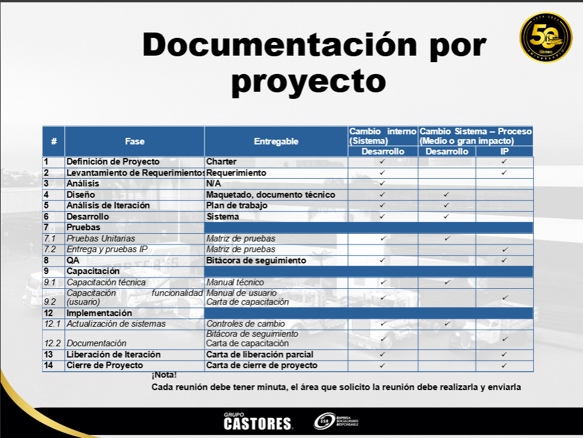

<!-- VS Previes md - Ctrl+Shift+V -->
# Fases del Proceso de Desarrollo

*2026-02-11*

_Proceso de Desarrollo de Productos de Software_ [Documento _Area_Desarrollo.pdf](https://castores.sharepoint.com/sites/Corporativo/TI/Desarrollo/Documentos%20compartidos/Documentaci%C3%B3nDesarrollo/Documento%20_Area_Desarrollo.pdf?CT=1770826160316&OR=ItemsView) 

## 1. Fase de Definición de Proyecto

El planteamiento de un proyecto de desarrollo de software consiste en identificar el problema o
proyecto, comprender las necesidades del cliente, los alcances del proyecto, los recursos necesarios
para dar una solución.
Los proyectos de desarrollo de productos de software dentro de Grupo Castores, se puede llevar solo
por el área de Desarrollo o en conjunto con el área de Ingeniería de Proyectos (IP)

## 2. Fase de Levantamiento de Requerimientos

Fase fundamental en el desarrollo de cualquier proyecto, ya sea de software, un sistema o un producto.
Consiste en la identificación, recopilación, documentación y análisis de todas las necesidades y
expectativas que tienen los usuarios, clientes o stakeholders (partes interesadas) respecto al producto
final.

Si el proyecto se realiza en conjunto el área de Desarrollo con Ingeniería de Proyectos (IP), el
levantamiento de requerimientos es responsabilidad de IP para posteriormente revisarlo con el área de
desarrollo.

* Documento del levantamiento requerimientos

## 3. Fase de Análisis

En esta fase, todo lo que se ha recolectado en el levantamiento de requerimientos se somete a un
escrutinio más profundo para comprender a fondo las necesidades del proyecto.
Identificar y resolver conflictos, ambigüedades o inconsistencias en los requerimientos, así como
técnicas para priorizarlos.
* Análisis de Requisitos Funcionales
* Análisis de Requisitos No Funcionales
* Priorización de Requerimientos
* Identificación y gestión de riesgos
* Definición de Casos de Uso
* Historias de Usuario
* Definición de Criterios de Aceptación

## 4. Fase de Diseño

En esta fase se transforma la idea inicial en una estructura sólida y detallada del producto final. Es
como crear el plano de una casa antes de comenzar la construcción: define cómo serán las diferentes
partes del software, cómo interactuarán entre sí y cómo se presentarán al usuario. Implica la definición
o realización de:
* Diseño de interfaces
* Diseño de bases de datos
* Diseño técnico
* Diccionario de Datos
* Diseño de casos de uso
* Diagramas de flujo o de proceso
* Diagramas de secuencia
* Estándares y calidad del software
* Arquitectura del software
* Diseño de Flujo de Datos
* Definición de estándares y buenas practicas de desarrollo

## 5. Fase de Análisis de Iteración

La Fase de Análisis de Iteración permite evaluar y planificar cada iteración o ciclo de desarrollo. En
este enfoque, el desarrollo se organiza en ciclos cortos y repetitivos, con el objetivo de mejorar
continuamente el producto y ajustar los requisitos según el feedback recibido.

## 6. Fase de Desarrollo

En esta fase se realiza la construcción de los componentes del sistema conforme al diseño aprobado. Se
realizan actividades tanto técnicas como de coordinación, asegurando que el producto cumpla con los
requisitos funcionales y no funcionales establecidos. A continuación, se describen los elementos y
actividades clave:
* Configuración del Entorno de Desarrollo
* Codificación de los Componentes del Sistema
* Control de Versiones y Gestión de Código
* Gestión de la Comunicación y Coordinación entre Equipos

## 7. Fase Pruebas

La fase de pruebas en desarrollo de software sirve para verificar y validar que el sistema cumple con
los requisitos, es funcional, confiable y está libre de errores críticos, existen diferentes tipos de pruebas
y se utilizan herramientas como matrices de prueba que sirven para planificar, organizar y hacer
seguimiento de las pruebas, asegurando que se cubran todos los requisitos y escenarios posibles del
sistema.

## 7.1. Pruebas Unitarias

Son las primeras pruebas que se hacen durante la fase de desarrollo de software.
Consisten en probar las piezas o unidades de la aplicación de software al
principio del ciclo de vida de desarrollo.
Estas pruebas unitarias se hacen a cualquier función, método, procedimiento o
módulo para determinar si hay algo que debe corregirse y cuál es el
comportamiento esperado.

## 7.2. Pruebas Funcionales

Las pruebas funcionales verifican que el software cumple con los requisitos
funcionales, evaluando cada función mediante entradas y salidas esperadas,
pueden dividirse en pruebas positivas y pruebas negativas.
Pruebas Positivas: Las pruebas positivas en desarrollo de software son
aquellas que verifican que el sistema funciona correctamente cuando se le
proporcionan entradas válidas y se siguen los caminos esperados. Su objetivo es
confirmar que el software cumple con los requisitos definidos.
Pruebas Negativas: Las pruebas negativas en desarrollo de software verifican
cómo el sistema maneja entradas no válidas o condiciones inesperadas,
buscando errores y asegurando que el fallo se maneje de manera controlada.

## 7.3. Pruebas de Validación de Datos

Las pruebas de validación de datos son un proceso crucial para garantizar que
los datos utilizados y producidos por una aplicación cumplan con los requisitos
de calidad, precisión e integridad necesarios y cumplan con el comportamiento
esperado.

## 7.4. Pruebas de Integración

Validación de la interacción entre los módulos y componentes desarrollados. A
medida que los módulos se completan, se prueba que funcionen correctamente
al integrarse, asegurando que los datos y funciones fluyan de acuerdo con los
requisitos.

## 7.5. Pruebas de aceptación

Las pruebas de aceptación del usuario son pruebas finales realizadas por el
cliente o usuarios finales para validar que el software cumple con los requisitos
y es apto para su uso en el entorno real.

## 8. Fase de QA
El ambiente de QA (Quality Assurance, o Aseguramiento de la Calidad) en un proyecto de sistemas de
información es esencial para garantizar que el sistema cumple con los requisitos funcionales y no
funcionales, es confiable, seguro y funciona según lo esperado antes de pasar a producción. Este
ambiente simula lo más fielmente posible las condiciones del entorno de producción para detectar y
corregir problemas antes del despliegue.

Configuración del Entorno de QA:

* Crear una infraestructura de pruebas que refleje el entorno de producción en cuanto a
configuración de servidores, base de datos, red y seguridad. Esto incluye preparar una base de
datos de pruebas que contenga datos de muestra para simular operaciones reales.
* Asegurar que el entorno de QA esté aislado, de modo que las pruebas no afecten los datos ni el
rendimiento del sistema.

El ambiente QA lo administra el área de Arquitectura dentro del departamento de TI de Grupo
Castores.

## 9. Fase de Capacitación

La capacitación técnica y de funcionalidad al entregar un producto de software consiste en:

1. Capacitación Técnica: Enseñar al equipo de soporte o TI aspectos como instalación,
configuración, mantenimiento, resolución de problemas, y gestión del sistema.

2. Capacitación de Funcionalidad: Explicar a los usuarios finales cómo usar el software,
enfocándose en las funciones principales, procesos específicos y casos prácticos del negocio.
Elaboración de:
* Manual técnico
* Manual de usuario

El objetivo es garantizar que tanto técnicos como usuarios puedan operar y mantener el software de
manera efectiva.

## 12. Fase de Implementación

La etapa de implementación de un producto de software desarrollado consiste en poner el sistema en
funcionamiento dentro del entorno operativo del cliente. Incluye:

1. Preparación del entorno: Configurar servidores, bases de datos, redes y otros elementos
técnicos necesarios, generalmente lo realiza el área de Infraestructura dentro del departamento
de TI de Grupo Castores .
2. Instalación: En caso que se requiera instalación, para desplegar el software en los sistemas del
cliente, esta actividad la realiza el área de Soporte dentro del departamento de TI de Grupo
Castores . .
3. Migración de datos: Para el caso que fuera necesario transferir datos de sistemas previos al
nuevo software, la actividad la realiza lo realiza el área de Infraestructura con apoyo del área
de desarrollo.
4. Pruebas en vivo: Verificar que el software funcione correctamente en el entorno real.
5. Soporte inicial: Resolver problemas y ajustar configuraciones durante el período inicial.
6. Seguimiento: Verificar que el sistema este funcionando y esta operando adecuadamente,
durante esta etapa el seguimiento sera diario y constante a cargo del área de desarrollo de TI.

El objetivo es asegurar que el software opere según lo esperado y genere valor para el cliente.

## 13. Fase de Liberación de Iteración

La etapa de liberación de iteración consiste en entregar una versión funcional y probada del software al
cliente o al entorno operativo al finalizar una iteración en el ciclo. El cliente debe entregar el visto
bueno para avalar la liberación.

## 14. Fase de Cierre de Proyecto

El cierre de proyecto en un desarrollo de software es la etapa final donde se formaliza la conclusión del
proyecto y se asegura su entrega completa. Consiste en:

1. Entrega final: Proveer al cliente el software, documentación, manuales y otros entregables
acordados.
2. Validación y aceptación: Obtener la aprobación del cliente confirmando que el software
cumple con los requisitos establecidos.
3. Documentación del cierre: Archivar información relevante como contratos, especificaciones y
registros de cambios.
4. Desmovilización del equipo: Reasignar recursos y disolver el equipo de proyecto.

El objetivo es garantizar que el cliente quede satisfecho y que el proyecto termine formalmente.